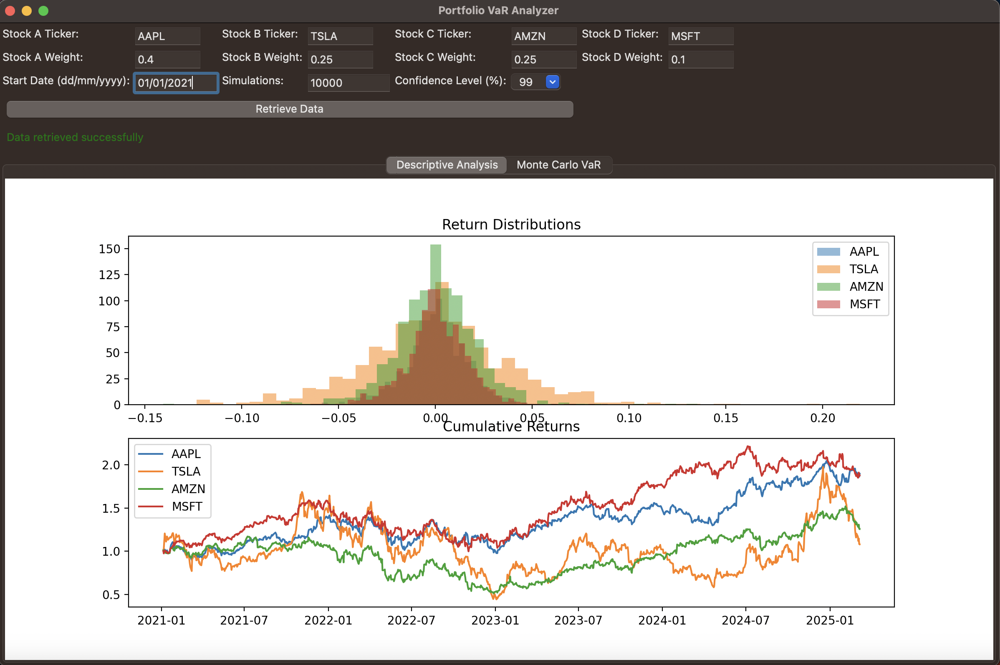
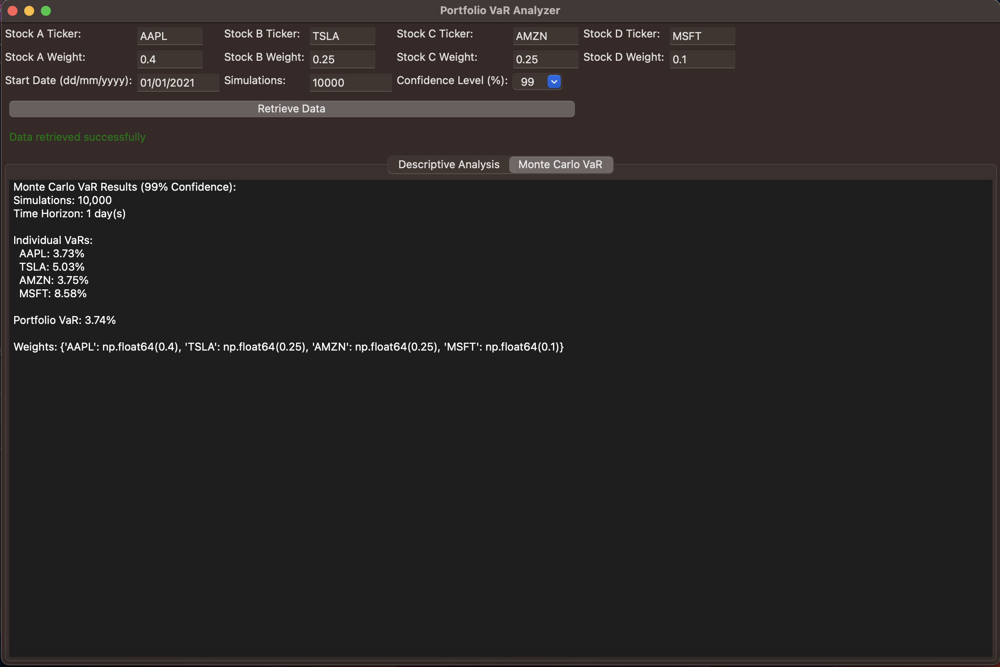

# 📊 Portfolio VaR Analyzer
A Python-based tool for risk analysis using Monte Carlo simulations.

## 🛠 Installation
1. Clone the repository:
   ```bash
   git clone https://github.com/MeetBabariya/Portfolio-VaR-Analyzer.git
   cd Portfolio-VaR-Analyzer
   
2. Install dependencies:
   ```bash
   pip install -r requirements.txt

3. Run the application:
   ```bash
   python tool1.py

## 📜 Features
- 📈 Retrieves stock data using Yahoo Finance  
- 🎲 Performs Monte Carlo Simulation for Value-at-Risk (VaR) calculations  
- 🖥️ Interactive wxPython GUI for data input and visualization  
- 📊 Displays histograms and cumulative returns
  
## 🖼 Screenshots
Here are some previews of the Portfolio VaR Analyzer:

### 📊 Main Interface


### 📈 Monte Carlo Simulation Results

